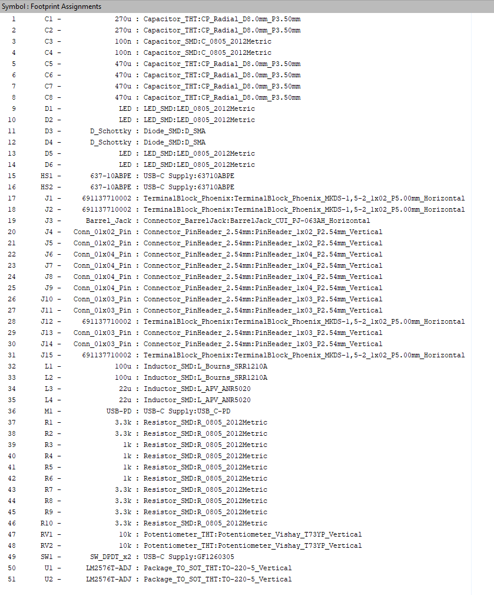

# WEEK 02 RESOURCES

## Summary

Oct 14th, 2025

- Intro to Symbol and Footprint Libraries
  - Brief discussion into SamacSys
- Intro to designing custom symbols
- Intro to designing custom footprints
- Intro to importing premade symbol and footprint libraries

## Tasks

- Assign all symbols to their corresponding footprints. All footprint assignments are shown in the image below.

## Files

### Altium Workshop Week 02 - Symbols and Footprints.pdf
Workshop introduction presentation. Used to cover a basic intro before covering the ECAD software.

### Schematic.pdf
PDF export of the schematic to be recreated by all attendees.